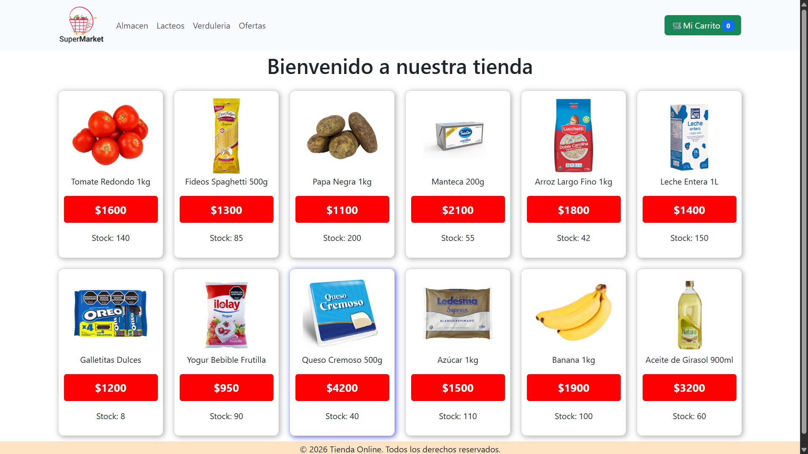

# Super React Market

Este es un proyecto desarrollado con **react** para ayudar a dueños de supermercados a vender su productos de manera online facil y rapido.

## Herramientas utilizadas en la web
- [React Botstrap v5.3.8](https://react-bootstrap.netlify.app/): Diseño y estilos.
- [React Router Dom v7.13.0](https://reactrouter.com/): Navegacion y rutas.
- [Firebase v12.9.0](https://console.firebase.google.com/): Base de datos.
- [React Hook Form](https://react-hook-form.com/): Validacion de formularios.
- [SeetAlert](https://sweetalert2.github.io/): Notificaciones tipo tostadas.

## Metodo de instalacion
1. Clone el repositorio.
`git clone https://github.com/alexhartkopf03-lab/React-CoderHouse.git`
2. Abra la capeta del proyecto en su editor de codigo.
3. En la terminal escriba el comando para instalar dependencias.
`npm install`
4. Nuevamente en la terminal escriba el comando para ejecutar el proyecto de manera local.
`npm run dev`

> Es necesario contar con Node v24.12.0 para la utilización del proyecto.

## Versión Web
Tambien puedo visualizar el proyecto de manera online sin descargar nada en el siguiente link:
[SuperMarket Online](https://google.com)

## Desarrollo
El proyecto esta actualmente siendo desarrollado por Alex Hartkopf.